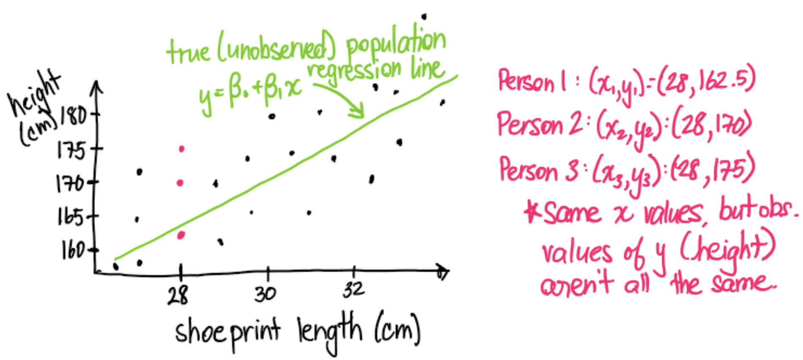
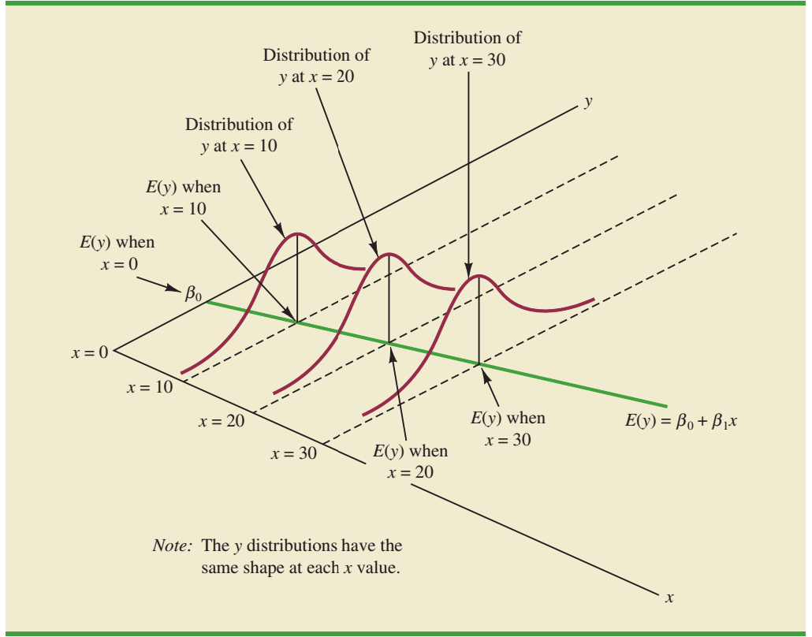

```{r, eval=TRUE, include=TRUE, echo=FALSE, message=FALSE, warning=FALSE}
# regarding `library()`: you don't have to `library(knitr)` if you `knitr::`
knitr::opts_chunk$set(eval=TRUE, include=TRUE, echo=TRUE, message=FALSE, warning=FALSE)

# knitting will default to pdf (rather than, e.g., html)
knitr::opts_chunk$set(dev='pdf')

# Defines a new code chunk `parameter=argument` option which will allow the
# size of printed code+output to be controlled using latex text size names:
# https://www.overleaf.com/learn/latex/Font_sizes%2C_families%2C_and_styles#Reference_guide
def.chunk.hook  <- knitr::knit_hooks$get("chunk")
knitr::knit_hooks$set(chunk = function(x, options) {
  x <- def.chunk.hook(x, options)
  ifelse(options$size != "normalsize", paste0("\n \\", options$size,"\n\n", x, "\n\n \\normalsize"), x)
})

color_block = function(color) {
  function(x, options) sprintf('\\color{%s}\\begin{verbatim}%s\\end{verbatim}',
                               color, x)
}
knitr::knit_hooks$set(message = color_block('red'))
knitr::knit_hooks$set(warning = color_block('red'))
knitr::knit_hooks$set(error = color_block('red'))
```

## Scatter Plot Visualization of Variable Association

:::columns
::::column

\vspace{.33cm}
*Estimation of stature from foot
and shoe length: applications in forensic science*

- by B. Rohren

```{r, size="footnotesize"}
library(tidyverse)
heights <- read_csv("heights.csv")
glimpse(heights)
```

\vspace{.3cm}
$\phantom{+}$

::::
::::column

```{r, size="footnotesize", fig.width=3, fig.height=2}
# {r, fig.width=3, fig.height=2}
heights %>% 
  ggplot(aes(x=shoePrint, y=height)) + 
  geom_point() + theme_light() +
  labs(title="Positive Linear Association",
       x="Length of Shoeprint (cm)",
       y="Height (cm)")
```

::::
:::


## Scatter Plot Visualization of Variable Association

:::columns
::::column

\vspace{.33cm}
*Estimation of stature from foot
and shoe length: applications in forensic science*

- by B. Rohren

```{r, size="footnotesize"}
library(tidyverse)
heights <- read_csv("heights.csv")
glimpse(heights)
```

\vspace{.3cm}
$\phantom{+}$

::::
::::column

```{r, size="footnotesize", fig.width=3, fig.height=2}
# {r, fig.width=3, fig.height=2}
heights %>% ggplot(aes(
  x=shoePrint, y=height, color=sex)) + 
  geom_point() + theme_gray() +
  labs(title="Positive Linear Association",
       x="Length of Shoeprint (cm)",
       y="Height (cm)")
```

::::
:::


## Scatter Plot Visualization of Variable Association

:::columns
::::column

\vspace{.33cm}
*Estimation of stature from foot
and shoe length: applications in forensic science*

- by B. Rohren

```{r, size="footnotesize"}
library(tidyverse)
heights <- read_csv("heights.csv")
glimpse(heights)
```

\vspace{.3cm}
$+$ [`facet_wrap()` / `facet_grid()`](https://ggplot2.tidyverse.org/reference/facet_wrap.html)

::::
::::column

```{r, size="footnotesize", fig.width=3, fig.height=2}
# {r, fig.width=3, fig.height=2}
heights %>% 
  ggplot(aes(x=shoePrint, y=height)) + 
  geom_point() + facet_wrap(~sex) +
  labs(title="Positive Linear Association",
       x="Length of Shoeprint (cm)",
       y="Height (cm)")
```

::::
:::

## Histogram Visualization of Variable Association

:::columns
::::column

\vspace{.33cm}
*Estimation of stature from foot
and shoe length: applications in forensic science*

- by B. Rohren

```{r, size="footnotesize"}
library(tidyverse)
heights <- read_csv("heights.csv")
glimpse(heights)
```

\vspace{.3cm}
$+$ [`facet_wrap()` / `facet_grid()`](https://ggplot2.tidyverse.org/reference/facet_wrap.html)

::::
::::column

```{r, size="footnotesize", fig.width=3, fig.height=2}
# {r, fig.width=3, fig.height=2}
heights %>% 
  ggplot(aes(x=shoePrint)) + 
  geom_histogram(bins=6) + 
  facet_wrap(~sex) +
  labs(title="Positive Linear Association",
       x="Length of Shoeprint (cm)")
```

::::
:::


## Sample Correlation $r$: Linear Association in $(x_i, y_i)$


:::columns
::::column

\vspace{.33cm}

1. First, **Correlation is not Causation**

   $\;$

2. 

\vspace{-.57in}

\begin{align*}
\quad r = & {} \frac{\sum_{i=1}^{n}(x_i-\bar x)(y_i-\bar y) }{\sqrt{\sum_{i=1}^{n}(x_i-\bar x)^2 \sum_{i=1}^{n}(y_i-\bar y)^2}} \\
& {} = \frac{\textcolor{gray}{(n-1)} s_{xy}}{\sqrt{\textcolor{gray}{(n-1)}s_x^2 \textcolor{gray}{(n-1)}s_y^2}}\\
& {} = \frac{s_{xy}}{s_x s_y} = \frac{\text{Cov}(x,y)}{\text{SD}(x) \text{SD}(y)}
\end{align*}

```{r, size="footnotesize"}
cor(heights$shoePrint, heights$height)
```

\vspace{.25cm}

- *Play "guess the correlation" at* http://www.istics.net/Correlations/

::::
::::column

```{r, size="footnotesize", fig.width=3, fig.height=2}
# {r, fig.width=3, fig.height=2}
heights %>% ggplot(aes(
  x=shoePrint, y=height)) + geom_point() + 
  geom_smooth(method=lm, se=FALSE) +
  labs(title="Positive Linear Association",
       x="Length of Shoeprint (cm)",
       y="Height (cm)") + theme_light()
```

::::
:::


## Sample Correlation $r$: Linear Association in $(x_i, y_i)$

\vspace{-.33in}

```{r, eval=FALSE, include=FALSE}
download.file(url = "https://upload.wikimedia.org/wikipedia/commons/thumb/d/d4/Correlation_examples2.svg/1200px-Correlation_examples2.svg.png",
              destfile = "images/corex.png", mode = 'wb')
```


$$r = \frac{\sum_{i=1}^{n}(x_i-\bar x)(y_i-\bar y) }{\sqrt{\sum_{i=1}^{n}(x_i-\bar x)^2 \sum_{i=1}^{n}(y_i-\bar y)^2}} = \frac{\textcolor{gray}{(n-1)} s_{xy}}{\sqrt{\textcolor{gray}{(n-1)}s_x^2 \textcolor{gray}{(n-1)}s_y^2}} = \frac{s_{xy}}{s_x s_y} = \frac{\text{Cov}(x,y)}{\text{SD}(x) \text{SD}(y)}$$

\vspace{-.1cm}

- The denominator scales the numerator so that the total $-1 \leq r \leq 1$ always
- $r$ measures *linear association*, with $r>0$ *positive* and $r<0$ means *negative*

| |
|-|
| {width=4in} |

\vspace{-1.5in}

Why no

\vspace{-.25cm}
Scale?

Does it

\vspace{-.25cm}
matter?

## Sample Correlation $r$: Linear Association in $(x_i, y_i)$

### Is $x$ more strongly associated with $y1$, $y2$, or $y3$?

```{r, echo=FALSE, fig.width=6, fig.height=2.25}
set.seed(11)
n <- 200;
x=rnorm(n = n, mean = 20, sd = 3)
dat <- data_frame(x=x, y=-5+x*0.3+rnorm(n = n, mean = 0, sd = 0.5))
fig1 <- dat %>% 
  ggplot(aes(x=x, y=y)) + geom_point(alpha=0.5) +
  labs(title=paste("Correlation: ", round(cor(dat$x,dat$y), digits=2), sep=""), y="y1")

dat <- data_frame(x=x, y=-5+(x-20)^2+rnorm(n = n, mean = 0, sd = 3))
fig2 <- dat %>% 
  ggplot(aes(x=x, y=y)) + geom_point(alpha=0.5)  +
  labs(title=paste("Correlation: ", round(cor(dat$x,dat$y), digits=2), sep=""), y="y2")

dat <- data_frame(x=x, y=-5+x+rnorm(n = n, mean = 0, sd = 12))
fig3 <- dat %>% 
  ggplot(aes(x=x, y=y)) + geom_point(alpha=0.5)  +
  labs(title=paste("Correlation: ", round(cor(dat$x,dat$y), digits=2), sep=""), y="y3")

library(gridExtra)
grid.arrange(fig1, fig2, fig3, ncol=3)
```

**Correlation is not Causation** but it is also only measures **LINEAR Association**

## Simple Linear Regression is a Normal Model

:::columns
::::column

$$E[Y_i|x_i] = \beta_0 + \beta_1 x_i$$
$$Y_i = \beta_0 + \beta_1 x_i + \epsilon_i, \quad \epsilon_i \sim N(0, \sigma^2)$$
$$Y_i \sim N(\beta_0 + \beta_1 x_i, \sigma^2)$$

### Parameters of the Normal Model

- $\beta_0$: \small '$Y$ if $x$ is $0$' \normalsize \textbf{\emph{intercept parameter}}

\vspace{.1cm}
- $\beta_1$: \small 'rise over run' \normalsize \textbf{\emph{slope parameter}}

\vspace{.1cm}
- $\epsilon_i$: the 'noise' or 'error' term

\vspace{.1cm}
- $x_i$: \small predictor, feature, covariate, or 

  \vspace{-.1cm}
  explanatory or independent variable; *as*
  
  \vspace{-.15cm}  
  *if a parameter was known without error* \normalsize

\vspace{.1cm}
- $Y_i$: response, outcome or dependent variable

::::
::::column

```{r, size="footnotesize", fig.height=2.5, fig.width=4}
# https://ggplot2.tidyverse.org/reference/
# geom_smooth.html
heights %>% ggplot(aes(
  x=shoePrint,y=height)) + geom_point() + 
  geom_smooth(method=lm, se=FALSE) + 
  labs(title="Simple Linear Regression",
       x="Length of Shoeprint (cm)", 
       y="Height (cm)")
```

::::
:::


## Simple Linear Regression is a Normal Model

:::columns
::::column

$$E[Y_i|x_i] = \beta_0 + \beta_1 x_i$$
$$Y_i = \beta_0 + \beta_1 x_i + \epsilon_i, \quad \epsilon_i \sim N(0, \sigma^2)$$
$$Y_i \sim N(\beta_0 + \beta_1 x_i, \sigma^2)$$

### Parameters of the Normal Model

- $\beta_0$: \small '$Y$ if $x$ is $0$' \normalsize \textbf{\emph{intercept parameter}}

\vspace{.1cm}
- $\beta_1$: \small 'rise over run' \normalsize \textbf{\emph{slope parameter}}

\vspace{.1cm}
- $\epsilon_i$: the 'noise' or 'error' term

\vspace{.1cm}
- $x_i$: \small predictor, feature, covariate, or 

  \vspace{-.1cm}
  explanatory or independent variable; *as*
  
  \vspace{-.15cm}  
  *if a parameter was known without error* \normalsize

\vspace{.1cm}
- $Y_i$: response, outcome or dependent variable

::::
::::column

```{r, size="tiny", fig.height=2.5, fig.width=4}
intercept <- lm(height~shoePrint, data=heights)$coeff[1]
# "-1" means a "zero intercept" model going through (0,0)
lm(height ~ -1 + shoePrint, data=heights)$coeff[1] -> 
  slope_if_intercept_is_0; coef0 <- slope_if_intercept_is_0

heights %>% add_row(tibble(shoePrint=0, height=intercept)) %>% 
  ggplot(aes(x=shoePrint,y=height)) + geom_point() + 
  geom_smooth(method=lm, se=FALSE) + 
  geom_segment(aes(x=x, y=y, xend=xend, yend=yend),
    data=tibble(x=0, y=0, xend=34.5, yend=34.5*coef0)) + 
  labs(title="Simple Linear Regression", y="Height (cm)",
       x="Length of Shoeprint (cm)")
```

::::
:::


## Simple Linear Regression is a Normal Model

\vspace{.2cm}

| For $x_i=x_j$ we will have $y_i \neq y_j$  |
|-|
| {width=4.5in} |

\vspace{-1.25cm}

\begin{align*}
\text{The expected value is } E[Y_i] = {} & \beta_0 + \beta_1 x_i \text{ but the actual value is} \\
Y_i\hphantom{]} = {} & \beta_0 + \beta_1 x_i + \epsilon_i \text{ where } \epsilon_i \sim N(0, \sigma^2)
\end{align*}


## Simple Linear Regression is a Normal Model

\vspace{.2cm}

```{r, eval=FALSE, include=FALSE}
download.file(url = "https://miro.medium.com/max/1400/1*Gb41be9uMyXYSxJoAJvJsQ.png",
              destfile = "images/classic.png", mode = 'wb')
```

| For $x_i=x_j$ we will have $y_i \neq y_j \;\; \rightarrow \;\; y_i = E[Y_i | x_i ] + \epsilon_i \text{ where } \epsilon_i \sim N(0, \sigma^2)$ 
|:-:|
| {width=3.25in} |


## Fitting Simple Linear Regression Models

$$\min_{\hat \beta_0, \hat \beta_1} \sum_{i=1}^n (y_i - \hat y_i)^2 = \min_{\hat \beta_0, \hat \beta_1} \sum_{i=1}^n \hat \epsilon_i^2 \quad \begin{array}{l}\text{ where } \quad \hat y_i = \hat \beta_0 + \hat \beta_1 x_i \\ \text{ estimates } \quad E[Y_i | x_i ] = \beta_0 + \beta_1 x \end{array}$$


### Method of Least Squares: minimize the sum of the squared residuals

```{r, echo=FALSE, fig.height=1.5, fig.width=5.5, fig.align="center"}
heights %>% ggplot(aes(
  x=shoePrint,y=height)) + geom_point() + 
  theme(axis.title.x=element_blank(),
        axis.title.y=element_blank()) + 
  geom_smooth(method=lm, se=FALSE) -> least_squares_plot

least_squares_data <- tibble(x=heights$shoePrint,
                  yhat=predict(lm(height~shoePrint, data=heights)),
                  y=heights$height)

for(i in 1:length(heights$height)){
  least_squares_plot <- least_squares_plot + 
    geom_segment(aes(x=x, y=y, xend=x, yend=yhat), 
                 data=least_squares_data[i,], color='red', size=1/3)
}

worse_prediction <- predict(lm(height~shoePrint, data=heights)) + 
                    -2.5*heights$shoePrint + 75

heights %>% ggplot(aes(
  x=shoePrint,y=height)) + geom_point() + 
  theme(axis.title.x=element_blank(),
        axis.title.y=element_blank()) + 
  geom_line(data=tibble(y=worse_prediction,
                        x=heights$shoePrint),
            aes(x=x,y=y)) -> least_squares_plot2

least_squares_data <- tibble(x=heights$shoePrint,
                  yhat=worse_prediction, y=heights$height)

for(i in 1:length(heights$height)){
  least_squares_plot2 <- least_squares_plot2 + 
    geom_segment(aes(x=x, y=y, xend=x, yend=yhat), 
                 data=least_squares_data[i,], color='red', size=1/3)
}

gridExtra::grid.arrange(least_squares_plot2, least_squares_plot, ncol=2)
```
 
:::columns
::::column
- Why square the *residual* $\hat \epsilon_i = y_i - \hat y_i$? 
::::
::::column
- $\hat \beta_0 = 80.930$ and $\hat \beta_1 = 3.219$
::::
:::

\vspace{.1cm}
- What are the *three largest residuals* under the fit model on the right?

## Fitting Simple Linear Regression Models

:::columns
::::column

\vspace{-.5cm}
\begin{align*}
\;\quad\quad \hat \beta_1 = {} &  r \frac{s_y}{s_x} =\textcolor{gray}{\frac{\sum_{i=1}^{n}(x_i-\bar x)(y_i-\bar y) }{\sqrt{\sum_{i=1}^{n}(x_i-\bar x)^2 \sum_{i=1}^{n}(y_i-\bar y)^2}} \frac{\sqrt{\frac{1}{n-1}\sum_{i=1}^{n}(y_i-\bar y)^2 }}{\sqrt{\frac{1}{n-1}\sum_{i=1}^{n}(x_i-\bar x)^2 }}}\\
\;\quad\quad = {} &\frac{\sum_{i=1}^{n}(x_i-\bar x)(y_i-\bar y) }{\sum_{i=1}^{n}(x_i-\bar x)^2}\\
\;\quad\quad \hat \beta_0 = {} &\bar y - \hat \beta_1 \bar x
\end{align*}

::::
::::column

\color{gray}
$\quad$***What*** is the *predicted*  
$\quad$expected value of $Y_i$    
$\quad$$E[Y_i|x_i] = \beta_0 + \beta_1 x_i$  
$\quad$if $x_i=30$ cm?  ***How***   
$\quad$much taller on average   
$\quad$are people with 5 cm  
$\quad$larger shoe prints?  

::::
:::

### $\hat \beta_0$ and $\hat \beta_1$ estimates of $\beta_0$ and $\beta_1$ and the `Response ~ Predictor` Notation

```{r, size="footnotesize"}
least_squares_fit <- lm( height ~ shoePrint , data=heights) # "response ~ predictor"
# least_squares_fit %>% summary() %>% broom::tidy() # library(broom)
summary(least_squares_fit)$coefficients
```


## Simple Linear Regression can be Interpreted

:::columns
::::column

$$\hat y_i = \hat \beta_0 + \hat \beta_1 x_i$$
$$\hat y_i = 80.93 + 3.22 x_i$$
$$\hat \epsilon_i = y_i - (80.93 + 3.22 x_i)$$
\vspace{-.2cm}
$$\text{all based on the idea (model) that}$$
\vspace{-.2cm}
$$y_i = \beta_0 + \beta_1 x_i + \epsilon \;/\; y_i \sim N(\beta_0 + \beta_1 x_i, \sigma^2) $$

::::
::::column

```{r, echo=FALSE, size="footnotesize", fig.height=2.5, fig.width=4}
# https://ggplot2.tidyverse.org/reference/
# geom_smooth.html
heights %>% ggplot(aes(
  x=shoePrint,y=height)) + geom_point() + 
  geom_smooth(method=lm, se=FALSE) + 
  labs(title="Simple Linear Regression",
       x="Length of Shoeprint (cm)", 
       y="Height (cm)")
```

::::
:::

The **parameters** of a **regression model** are often called ***regression coefficients***

\vspace{-.15cm}

\begin{block}{The \textbf{\emph{slope coefficient}} is interpreted as "difference in Y per unit change in x"}
"\texttt{Height} \emph{increases} by 3.22 cm \textbf{on average} per 1 cm \emph{increase} in \texttt{shoePrint} length"
\end{block}

\vspace{-.25cm}
Linear model $\hat \beta_1 = r\frac{s_y}{s_x}$ associations are not causal: **"correlation is not causation"**

\vspace{-.15cm}
\textcolor{gray}{\emph{Should we predict (extrapolate) the expected value of $Y_i$ using this data if $x_i=10$ cm?}}


## The Coefficient of Determination $R^2$

$$R^2 = \frac{\sum_{i=1}^n(y_i - \bar y)^2 - \sum_{i=1}^n(y_i - \hat y_i)^2}{\sum_{i=1}^n(y_i - \bar y)^2} =  1- \frac{\sum_{i=1}^n(y_i - \hat y_i)^2}{\sum_{i=1}^n(y_i - \bar y)^2} \textcolor{gray}{\; = r^2}$$

### The "Proportion of Variation Explained" is a *Measure of Model Fit* 

```{r, echo=FALSE, fig.height=1.5, fig.width=5, fig.align="center"}
heights %>% ggplot(aes(
  x=shoePrint,y=height)) + geom_point() + 
  theme(axis.title.x=element_blank(),
        axis.title.y=element_blank()) + 
  geom_smooth(method=lm, se=FALSE) -> least_squares_plot

least_squares_data <- tibble(x=heights$shoePrint,
                  yhat=predict(lm(height~shoePrint, data=heights)),
                  y=heights$height)

for(i in 1:length(heights$height)){
  least_squares_plot <- least_squares_plot + 
    geom_segment(aes(x=x, y=y, xend=x, yend=yhat), 
                 data=least_squares_data[i,], color='red', size=1/3)
}

worse_prediction <- 0*heights$shoePrint + mean(heights$height)

heights %>% ggplot(aes(
  x=shoePrint,y=height)) + geom_point() + 
  theme(axis.title.x=element_blank(),
        axis.title.y=element_blank()) + 
  geom_line(data=tibble(y=worse_prediction,
                        x=heights$shoePrint),
            aes(x=x,y=y)) -> least_squares_plot2

least_squares_data <- tibble(x=heights$shoePrint,
                  yhat=worse_prediction, y=heights$height)

for(i in 1:length(heights$height)){
  least_squares_plot2 <- least_squares_plot2 + 
    geom_segment(aes(x=x, y=y, xend=x, yend=yhat), 
                 data=least_squares_data[i,], color='red', size=1/3)
}

# library(gridExtra)
gridExtra::grid.arrange(least_squares_plot2, least_squares_plot, ncol=2)
```

- What is the proportion reduction in the *squared residuals*?

  \textcolor{gray}{[$R^2$ is equal to $r^2$ only for Simple Linear Regression]}


## The Coefficient of Determination $R^2$

$$R^2 = \frac{\sum_{i=1}^n(y_i - \bar y)^2 - \sum_{i=1}^n(y_i - \hat y_i)^2}{\sum_{i=1}^n(y_i - \bar y)^2} =  1- \frac{\sum_{i=1}^n(y_i - \hat y_i)^2}{\sum_{i=1}^n(y_i - \bar y)^2} \textcolor{gray}{\; = r^2}$$

### Which of these looks like a better explanatory model?

```{r, echo=FALSE, fig.height=1.5, fig.width=5, fig.align="center"}
heights %>% ggplot(aes(
  x=shoePrint,y=height)) + geom_point() + 
  theme(axis.title.x=element_blank(),
        axis.title.y=element_blank()) + 
  geom_smooth(method=lm, se=FALSE) -> least_squares_plot

least_squares_data <- tibble(x=heights$shoePrint,
                  yhat=predict(lm(height~shoePrint, data=heights)),
                  y=heights$height)

for(i in 1:length(heights$height)){
  least_squares_plot <- least_squares_plot + 
    geom_segment(aes(x=x, y=y, xend=x, yend=yhat), 
                 data=least_squares_data[i,], color='red', size=1/3)
}

least_squares_plot2 <- heights %>% ggplot(aes(x=shoePrint, y=height)) + 
  geom_point() + theme(axis.title.x=element_blank(), axis.title.y=element_blank())

worse_prediction <- 0*heights$shoePrint + mean(heights$height)
worse_prediction[heights$sex=="M"] <- mean(heights$height[heights$sex=="M"])
worse_prediction[heights$sex=="F"] <- mean(heights$height[heights$sex=="F"])
least_squares_data <- tibble(x=heights$shoePrint,
                  yhat=worse_prediction, y=heights$height)

for(i in 1:length(heights$height)){
  least_squares_plot2 <- least_squares_plot2 + 
    geom_segment(aes(x=x, y=y, xend=x, yend=yhat), 
                 data=least_squares_data[i,], color='red', size=1/3)
}

better_prediction_M <- 0*heights$shoePrint + mean(heights$height[heights$sex=="M"])
better_prediction_F <- 0*heights$shoePrint + mean(heights$height[heights$sex=="F"])
least_squares_plot2 <- least_squares_plot2 + 
  geom_line(data=tibble(y=better_prediction_M,
                        x=heights$shoePrint), 
                        aes(x=x,y=y), color='blue') +
  geom_line(data=tibble(y=better_prediction_F,
                        x=heights$shoePrint), 
                        aes(x=x,y=y), color='blue')
# library(gridExtra)
gridExtra::grid.arrange(least_squares_plot, least_squares_plot2, ncol=2)
```

- What is the proportion reduction in the *squared residuals* for each?

  \textcolor{gray}{[The two lines are "Male" and "Female": is this Simple Linear Regression?]}

## The Coefficient of Determination $R^2$

\vspace{-.2cm}

$$R^2 = \frac{\sum_{i=1}^n(y_i - \bar y)^2 - \sum_{i=1}^n(y_i - \hat y_i)^2}{\sum_{i=1}^n(y_i - \bar y)^2} =  1- \frac{\sum_{i=1}^n(y_i - \hat y_i)^2}{\sum_{i=1}^n(y_i - \bar y)^2} \textcolor{gray}{\; = r^2}$$

### The "Proportion of Variation Explained" is a *Measure of Model Fit*

:::columns
::::column

$$Y_i = \beta_0 + \beta_1 x_{i} + \epsilon_i$$

```{r, size="footnotesize"}
summary(least_squares_fit)$r.squared
#for Simple Linear Regression that equals
cor(heights$shoePrint, heights$height)^2

least_squares_fit2 <- # different "x"
  lm(height~sex, data=heights)
summary(least_squares_fit2)$r.squared
```

::::
::::column

```{r, size="footnotesize", fig.width=4, fig.height=1.75}
heights %>% ggplot(aes(y=sex, x=height))+ 
  geom_boxplot() + theme_light() +
  labs(y="Indicator Variable\n(sex)",
       x="Height (cm)")
```

::::
:::


## How Indicator Variables Work

:::columns
::::column

\vspace{-.66cm}
```{r, echo=FALSE, size="footnotesize"}
least_squares_fit2 
```

- $\hat \beta_1$ is called a *contrast* as it captures a difference between groups

::::
::::column

\begin{align*}
\quad\quad Y_i = {} & \beta_0 + \beta_1 1_{x_i=\text{M}}(x_i) + \epsilon_i\\
\quad\quad \hat y_i = {} & 166.82 + 15.79 \times 1_{x_i=\text{M}}(x_i)\\
\quad\quad \hat y_i = {} & \begin{cases}
\begin{array}{lr}166.82 (\hat \beta_0) \quad \text{[baseline]} & \text{if }\texttt{sex}=\text{F}\\ 166.82(\hat \beta_0) + 15.79 (\hat \beta_1) & \;\text{ if }\texttt{sex}=\text{M} \end{array}
\end{cases}
\end{align*}

::::
:::

```{r, echo=FALSE, fig.height=2, fig.width=7, fig.align="center"}
heights %>% ggplot(aes(
  x=shoePrint, y=height, color=sex)) + 
  geom_point() + theme_light() +
  labs(title="No Explanatory Variables",
       x="Length of Shoeprint (cm)\nNOT USED IN MODEL",
       y="Height (cm)") -> least_squares_plot

worse_prediction <- 0*heights$shoePrint + mean(heights$height)
least_squares_data <- tibble(x=heights$shoePrint,
                  yhat=worse_prediction, y=heights$height)

for(i in 1:length(heights$height)){
  least_squares_plot <- least_squares_plot + 
    geom_segment(aes(x=x, y=y, xend=x, yend=yhat), 
                 data=least_squares_data[i,], color='black', size=1/3)
}

worse_prediction <- 0*heights$shoePrint + mean(heights$height)
better_prediction_M <- 0*heights$shoePrint + mean(heights$height[heights$sex=="M"])
better_prediction_F <- 0*heights$shoePrint + mean(heights$height[heights$sex=="F"])

least_squares_plot <- least_squares_plot + 
  geom_line(data=tibble(y=worse_prediction,
                        x=heights$shoePrint), aes(x=x,y=y), color='black')

heights %>% ggplot(aes(
  x=shoePrint, y=height, color=sex)) + 
  geom_point() + theme_light() +
  labs(title="Using an Indiator Variable",
       x="Length of Shoeprint (cm)\nNOT USED IN MODEL",
       y="Height (cm)") -> least_squares_plot2

worse_prediction <- 0*heights$shoePrint + mean(heights$height)
worse_prediction[heights$sex=="M"] <- mean(heights$height[heights$sex=="M"])
worse_prediction[heights$sex=="F"] <- mean(heights$height[heights$sex=="F"])
least_squares_data <- tibble(x=heights$shoePrint,
                  yhat=worse_prediction, y=heights$height)

for(i in 1:length(heights$height)){
  least_squares_plot2 <- least_squares_plot2 + 
    geom_segment(aes(x=x, y=y, xend=x, yend=yhat), 
                 data=least_squares_data[i,], color='black', size=1/3)
}

least_squares_plot2 <- least_squares_plot2 + 
  geom_line(data=tibble(y=better_prediction_M,
                        x=heights$shoePrint,
                        sex=rep("M", length(heights$shoePrint))), 
                        aes(x=x,y=y,color=sex)) +
  geom_line(data=tibble(y=better_prediction_F,
                        x=heights$shoePrint,
                        sex=rep("F", length(heights$shoePrint))), 
                        aes(x=x,y=y,color=sex))
# library(gridExtra)
gridExtra::grid.arrange(least_squares_plot, least_squares_plot2, ncol=2)
```

## How Indicator Variables Work

:::columns
::::column

```{r, echo=FALSE}
library(broom) # for `tidy()`
```
```{r, eval=FALSE, size="footnotesize"}
tibble(sexM=as.numeric(heights$sex=="M"), 
       y=heights$height) -> version_1
lm(y~sexM, data=version_1) %>% 
  tidy() %>% select(-std.error)
```
```{r, echo=FALSE, size="scriptsize"}
tibble(sexM=as.numeric(heights$sex=="M"), 
       y=heights$height) -> version_1
lm(y~sexM, data=version_1) %>% 
  tidy() %>% select(-std.error)
```

```{r, echo=FALSE, fig.height=1.25, fig.width=2.5}
tibble(x=as.numeric(heights$sex=="M"), 
       `height (cm)`=heights$height) %>% 
  ggplot(aes(x=x,y=`height (cm)`)) + 
  geom_point() + xlim(c(-1,3)) +
  xlab('"M" is 1 and "F" is 0') +
  geom_smooth(method=lm, se=FALSE) 
```

\vspace{-.25cm}
```{r, size="footnotesize"}
cor(heights$sex=="M", heights$height)
```

::::
::::column

```{r, echo=FALSE}
library(broom) # for `tidy()`
```
```{r, eval=FALSE, size="footnotesize"}
tibble(sexM=2*as.numeric(heights$sex=="M"), 
       y=heights$height) -> version_2
lm(y~sexM, data=version_2) %>% 
  tidy() %>% select(-std.error)
```
```{r, echo=FALSE, size="scriptsize"}
tibble(sexM=2*as.numeric(heights$sex=="M"), 
       y=heights$height) -> version_2
lm(y~sexM, data=version_2) %>% 
  tidy() %>% select(-std.error)
```

```{r, echo=FALSE, fig.height=1.25, fig.width=2.5}
tibble(x=2*as.numeric(heights$sex=="M"), 
       `height (cm)`=heights$height) %>% 
  ggplot(aes(x=x,y=`height (cm)`)) + 
  geom_point() + xlim(c(-1,3)) +
  xlab('"M" is 2 and "F" is 0') +
  geom_smooth(method=lm, se=FALSE)
```

\vspace{-.25cm}
```{r, size="footnotesize"}
cor(2*(heights$sex=="M"), heights$height)
```

::::
:::

## How Scaling Variables Works Generally

:::columns
::::column

```{r, eval=FALSE, size="footnotesize"}
lm(height~shoePrint, data=heights) %>% 
  tidy() %>% select(-std.error)
```
```{r, echo=FALSE, size="scriptsize"}
lm(height~shoePrint, data=heights) %>% 
  tidy() %>% select(-std.error)
```
```{r, echo=FALSE, fig.height=1.4, fig.width=2.5}
tibble(`length of shoeprint (cm)`=heights$shoePrint, 
       `height (cm)`=heights$height) %>% 
  ggplot(aes(x=`length of shoeprint (cm)`, y=`height (cm)`)) + 
  geom_point() + geom_smooth(method=lm, se=FALSE)
```
```{r, size="footnotesize"}
cor(heights$shoePrint, heights$height)
```

::::
::::column

```{r, eval=FALSE, size="footnotesize"}
lm(height~I(shoePrint/2.54), data=heights) %>% 
  tidy() %>% select(-std.error)
```
```{r, echo=FALSE, size="scriptsize"}
lm(height~I(shoePrint/2.54), data=heights) %>% 
  tidy() %>% select(-std.error)
```
```{r, echo=FALSE, fig.height=1.4, fig.width=2.5}
tibble(`length of shoeprint (in)`=heights$shoePrint/2.54, 
       `height (cm)`=heights$height) %>% 
  ggplot(aes(x=`length of shoeprint (in)`, y=`height (cm)`)) + 
  geom_point() + geom_smooth(method=lm, se=FALSE)
```
```{r, size="footnotesize"}
cor(heights$shoePrint/2.54, heights$height)
```


::::
:::

## Hypothesis Testing for Linear Model Regression 

Will $\hat \beta_0 = \beta_0$? Will $\hat \beta_1 = \beta_1$?
What would a NULL hypothesis of $H_0: \beta_1=0$ mean?
How about $H_0: \beta_0=0$? 
What are corresponding the ALTERNATIVE hypotheses here?
What's the result and interpretation of $\alpha=0.05$ significance testing the models below?

<!-- $\text{"The coefficient $\beta$ has NO EFFECT in the model"}$ -->
<!-- The ALTERNATIVE to the NULL Hypothesis is as always $H_A/H_1: H_0 \text{ is } \texttt{FALSE}$ -->

### The `statistic` and `p.value` outputs are based on $H_0: \beta=0$

:::columns
::::column

```{r, size="scriptsize"}
lm(height~shoePrint, data=heights) %>% 
  tidy() %>% select(-std.error)
```

::::
::::column

```{r, size="scriptsize"}
lm(height~sex, data=heights) %>% 
  tidy() %>% select(-std.error)
```

::::
:::

\vspace{.25cm}

- These tests depend on the $y_i \sim N(\beta_0+\beta_1 x_i, \sigma^2)$ model being `TRUE`.
- This entails *normality, homoskedasticity, independence*, and *linearity* assumptions.

### $\rightarrow$ Confidence Intervals on Regression Coefficient values are then also possible

\vspace{-.75cm}


## Questions

lots of questions in the weeks online class materials


## Next Class... 

### 

```{r, size="footnotesize"}
lm(height~shoePrint, data=heights) %>% tidy() # R^2 0.6608845
lm(height~sex, data=heights) %>% tidy() %>% as.matrix() # R^2 0.6283874
lm(height~shoePrint+sex, data=heights) %>% tidy() %>% as.matrix() # R^2 0.6909145
# summary(lm(height~shoePrint+sex, data=heights))$r.squared
```


<!-- 
## The Coefficient of Determination $R^2$
\vspace{-.2cm}
$$R^2 = \frac{\sum_{i=1}^n(y_i - \bar y)^2 - \sum_{i=1}^n(y_i - \hat y_i)^2}{\sum_{i=1}^n(y_i - \bar y)^2} =  1- \frac{\sum_{i=1}^n(y_i - \hat y_i)^2}{\sum_{i=1}^n(y_i - \bar y)^2} \textcolor{gray}{\; = r^2}$$
### The "Proportion of Variation Explained" is a *Measure of Model Fit*
:::columns
::::column
$$Y_i = \beta_0 + \beta_1 x_{1i} + \epsilon_i$$
```{r, size="footnotesize"}
summary(least_squares_fit)$r.squared
# and for Simple Linear Regression
# this is equal to
cor(heights$shoePrint, heights$height)^2
```
::::
::::column
$$Y_i = \beta_0 + \beta_1 x_{1i} + \beta_1 x_{2i} + \epsilon_i$$
```{r, size="footnotesize"}
least_squares_fit2 <- 
  lm(height~shoePrint+sex, data=heights)
summary(least_squares_fit2)$r.squared
```
- Do you understand this model?
- Is the increase in $R^2$ expected?
::::
:::
\vspace{-.6cm}
### 
Which model makes better predictions of the data? Is $R^2$ a good way to decide?
\vspace{-.75cm}
-->

